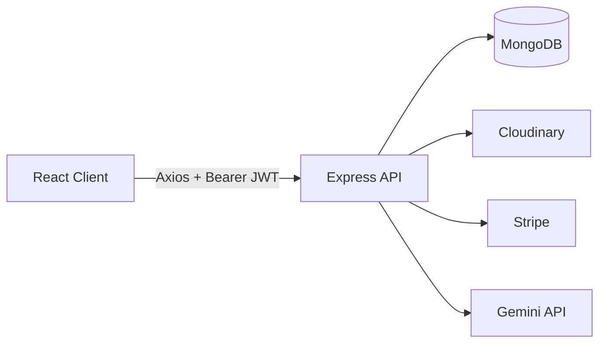

# GreenCart


Aplikasi e-commerce grocery (MERN stack) lengkap dengan cart, checkout (COD & Stripe), dashboard seller, dan fitur AI untuk generate ide resep dari isi keranjang belanja pakai Google Gemini.

## Daftar Isi

- [Fitur](#fitur)
- [Tech Stack](#tech-stack)
- [Arsitektur](#arsitektur)
- [Struktur Folder](#struktur-folder)
- [Environment Variables](#environment-variables)
- [Instalasi](#instalasi)
- [API Endpoints](#api-endpoints)
- [Catatan](#catatan)

## Fitur

**Customer**
- Register/login (JWT + bcrypt)
- Browse produk per kategori, cari, dan lihat detail
- Cart tersimpan per user (`cartItems` di dokumen user)
- Checkout via Cash on Delivery atau Stripe
- Kelola alamat pengiriman
- Riwayat pesanan
- Generate ide resep dari isi cart pakai AI (Gemini), lengkap dengan penjelasan tiap resep

**Seller**
- Login terpisah dari customer (role-based, field `role` di model `User`)
- Tambah produk dengan upload sampai 4 gambar (Multer → Cloudinary)
- Update stok produk
- Lihat semua pesanan yang masuk

## Tech Stack

| Layer | Teknologi |
|---|---|
| Frontend | React 19, Vite, Tailwind CSS 4, React Router 7 |
| State/HTTP | Context API, Axios, react-hot-toast |
| Backend | Node.js, Express 5, JWT, bcryptjs |
| Database | MongoDB + Mongoose |
| Upload gambar | Multer (lokal) + Cloudinary |
| Pembayaran | Stripe |
| AI | Google Gemini (`@google/genai`, model `gemini-2.0-flash`) |

## Arsitektur



## Struktur Folder

Repo ini monorepo dua folder terpisah, masing-masing punya `package.json` sendiri:

```
GreenCart/
├── backend/
│   ├── config/          # koneksi DB, Cloudinary, Multer
│   ├── controllers/     # logic tiap resource (auth, product, order, ai, dst)
│   ├── middlewares/     # auth guard (protect), upload handler
│   ├── models/          # schema Mongoose
│   ├── routes/          # definisi endpoint
│   ├── uploads/         # fallback storage lokal untuk file upload
│   └── server.js
└── client/
    ├── src/
    │   ├── components/  # Navbar, ProductCard, Cards, dsb
    │   ├── context/      # AppContext (cart, currency, dsb)
    │   ├── pages/        # Home, Cart, ProductDetails, Seller/*, Auth/*
    │   └── utils/        # axiosInstance, apiPaths
    └── vite.config.js
```

## Environment Variables

**`backend/.env`**

| Variable | Keterangan |
|---|---|
| `PORT` | Port server, default `5000` |
| `MONGO_URI` | Connection string MongoDB |
| `JWT_SECRET` | Secret untuk sign token JWT |
| `CLIENT_URL` | Origin frontend untuk CORS (selain `localhost:5173`) |
| `CLOUDINARY_CLOUD_NAME` | Kredensial Cloudinary |
| `CLOUDINARY_API_KEY` | Kredensial Cloudinary |
| `CLOUDINARY_API_SECRET` | Kredensial Cloudinary |
| `STRIPE_SECRET_KEY` | Secret key Stripe |
| `STRIPE_WEBHOOK_SECRET` | Untuk verifikasi webhook Stripe |
| `GEMINI_API_KEY` | API key Google Gemini, dipakai fitur generate resep |

**`client/.env`**

| Variable | Keterangan |
|---|---|
| `VITE_CURRENCY` | Simbol mata uang yang ditampilkan di UI |

## Instalasi

Prasyarat: Node.js ≥ 18, MongoDB (lokal atau Atlas), akun Cloudinary, Stripe, dan Google AI Studio (buat API key Gemini).

**Backend**

```bash
cd backend
npm install
cp .env.example .env    # isi sesuai tabel di atas kalau file .env belum ada
npm run dev              # nodemon, auto-restart
```

**Frontend** (terminal terpisah)

```bash
cd client
npm install
npm run dev
```

Frontend jalan di `http://localhost:5173`, backend default di `http://localhost:5000` sesuai `server.js`.

## API Endpoints

| Method | Endpoint | Proteksi | Keterangan |
|---|---|---|---|
| POST | `/api/auth/register` | Public | Registrasi user |
| POST | `/api/auth/login` | Public | Login user |
| GET | `/api/auth/profile` | JWT | Profil user login |
| POST | `/api/seller/register` / `/login` | Public | Auth khusus seller |
| GET | `/api/product/list` | Public | Daftar produk |
| GET | `/api/product/id` | Public | Detail produk |
| POST | `/api/product/add` | JWT | Tambah produk (max 4 gambar) |
| POST | `/api/product/stock` | JWT | Update status stok |
| POST | `/api/cart/update` | JWT | Sinkronisasi isi cart |
| POST | `/api/address/add` / GET `/get-address` | JWT | Kelola alamat |
| POST | `/api/order/cod` / `/stripe` | JWT | Buat pesanan |
| GET | `/api/order/user` / `/seller` | JWT | Riwayat pesanan |
| POST | `/api/ai/generate-recipe` | JWT | Generate ide resep dari cart |
| POST | `/api/ai/generate-explanation` | JWT | Penjelasan detail satu resep |

## Catatan

- `client/src/utils/apiPaths.js` saat ini meng-hardcode `BASE_URL` ke `http://localhost:8000`, sementara backend default jalan di port `5000` — sesuaikan salah satunya kalau nanti ketemu error koneksi.
- Endpoint webhook Stripe (`stripeWebHooks` di `orderController.js`) belum di-mount di `server.js` — perlu diaktifkan manual kalau mau pakai pembayaran Stripe end-to-end.
- Folder `backend/uploads` dipakai sebagai fallback penyimpanan lokal; untuk gambar produk, flow utamanya tetap lewat Cloudinary.
