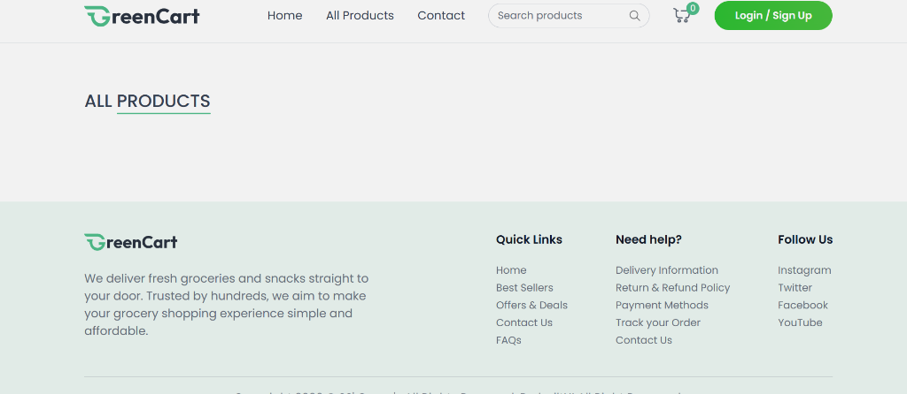
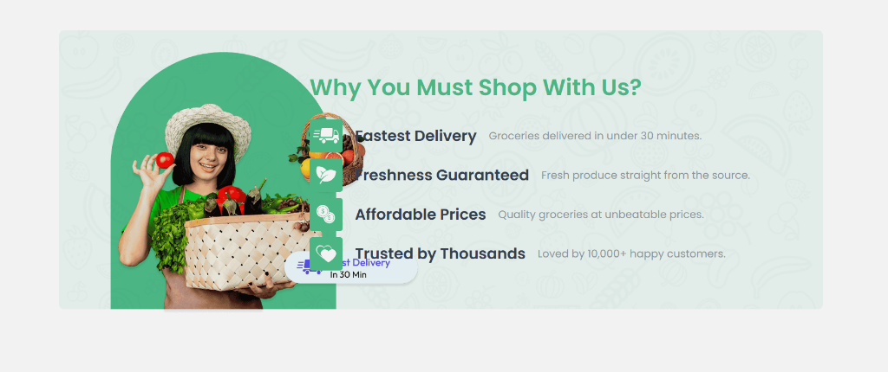

<div align="center">
  

  # 🛒 GreenCart — AI-Powered Grocery App

  **Belanja kebutuhan sehari-hari lebih mudah, cerdas, dan menyenangkan dengan bantuan AI.**

  
  
  
  
  

</div>

---

## 📸 Tampilan UI

### 🏠 Halaman Utama & Navigasi


### 🌟 Kenapa Belanja di GreenCart?


---

## ✨ Fitur Utama

| Fitur | Keterangan |
|-------|-----------|
| 🤖 **AI Recipe Generator** | Generate resep masakan dari bahan yang dipilih menggunakan Google Gemini AI |
| 🛍️ **Belanja Produk** | Browse & beli produk segar dari berbagai kategori |
| 🔍 **Pencarian Cerdas** | Cari produk berdasarkan nama atau kategori |
| 🛒 **Keranjang Belanja** | Tambah, kurangi, atau hapus item dari cart |
| 📦 **Lacak Pesanan** | Pantau status pesanan secara real-time |
| 👤 **Autentikasi** | Register & login untuk user dan seller |
| 🏪 **Seller Dashboard** | Seller bisa tambah & kelola produk sendiri |
| 📍 **Manajemen Alamat** | Simpan & kelola alamat pengiriman |
| 💳 **Pembayaran** | Integrasi Stripe untuk pembayaran online |

---

## 🧱 Tech Stack

### Frontend
- ⚛️ **React 19** + **Vite 7**
- 🎨 **Tailwind CSS** — utility-first styling
- 🔗 **React Router DOM** — client-side routing
- 📡 **Axios** — HTTP client dengan interceptor
- 🔔 **React Hot Toast** — notifikasi

### Backend
- 🟢 **Node.js** + **Express 5**
- 🍃 **MongoDB** + **Mongoose** — database
- 🔐 **JWT** — autentikasi token
- ☁️ **Multer** — upload gambar produk
- 🤖 **Google Gemini AI** (`@google/genai`) — AI features

---

## 🚀 Cara Menjalankan Lokal

### 1. Clone Repository
```bash
git clone https://github.com/NAxel-code/GreenCart-AI-App.git
cd GreenCart-AI-App
```

### 2. Setup Backend
```bash
cd backend
npm install
```

Buat file `.env` di folder `backend/`:
```env
PORT=8000
MONGO_URI=mongodb+srv://<username>:<password>@cluster.mongodb.net/greencart
JWT_SECRET=your_jwt_secret
GEMINI_API_KEY=your_gemini_api_key
STRIPE_SECRET_KEY=your_stripe_secret_key
```

Jalankan backend:
```bash
npm run dev
```

### 3. Setup Frontend
```bash
cd client
npm install
```

Buat file `.env` di folder `client/`:
```env
VITE_CURRENCY=$
```

Jalankan frontend:
```bash
npm run dev
```

### 4. Buka Browser
```
http://localhost:5173
```

---

## 📁 Struktur Project

```
GreenCart (AI App)/
├── backend/
│   ├── config/          # Konfigurasi database
│   ├── controllers/     # Logic handler API
│   ├── middlewares/     # Auth middleware
│   ├── models/          # Mongoose models
│   ├── routes/          # API routes
│   ├── utils/           # Helper & AI prompts
│   └── server.js        # Entry point backend
│
├── client/
│   ├── src/
│   │   ├── assets/      # Gambar & data dummy
│   │   ├── components/  # Komponen reusable
│   │   ├── context/     # Global state (AppContext)
│   │   ├── pages/       # Halaman utama
│   │   └── utils/       # Axios instance & API paths
│   └── index.html
│
└── screenshots/         # Screenshot UI
```

---

## 👥 Tim Pengembang

**Kelompok 5** — AI Application Development

---

## 📄 Lisensi

Project ini dibuat untuk keperluan akademik.
